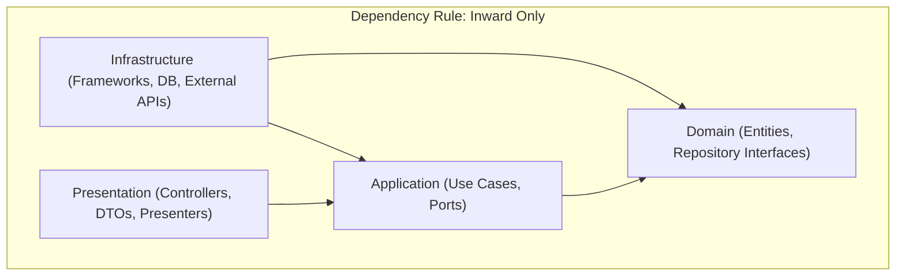

# Architecture & Technical Design

RediSetHack V2 is a modern, gamified programming learning platform built as a Turborepo monorepo with NestJS, Next.js, Drizzle ORM, and PostgreSQL.

This document details the high-level system topology, Clean Architecture boundaries, module structure, progression mechanics, and operational standards.

---

## 1. High-Level System Architecture

RediSetHack V2 follows a decoupled, service-oriented architecture designed for scalability, type safety, and testability.

```mermaid
graph TD
    subgraph Client ["Client Layer"]
        Web["apps/web (Next.js 16 App Router)"]
    end

    subgraph Auth ["Authentication"]
        Clerk["Clerk Auth Provider"]
    end

    subgraph Backend ["Backend Layer (apps/api)"]
        Presentation["Presentation Layer (Single-Action Controllers, DTOs, Presenters)"]
        Application["Application Layer (Use Cases, Application Services, Ports)"]
        Domain["Domain Layer (Entities, Value Objects, Domain Events, Repositories)"]
        Infrastructure["Infrastructure Layer (Drizzle Adapters, External Integrations)"]
    end

    subgraph Persistence ["Persistence Layer (packages/db)"]
        DrizzleKit["Drizzle ORM"]
        Postgres[(PostgreSQL Database)]
    end

    subgraph Sandbox ["Execution Engine"]
        CodeRunner["Multi-Language Sandbox (Codelab Engine)"]
    end

    Web -->|User Auth & Sessions| Clerk
    Web -->|HTTP / REST (v1/api/*)| Presentation
    Presentation -->|JWT Verification| Clerk
    Presentation --> Application
    Application --> Domain
    Infrastructure -.->|Implements Ports| Application
    Infrastructure -.->|Persists / Queries| Domain
    Infrastructure --> DrizzleKit
    DrizzleKit --> Postgres
    Infrastructure --> CodeRunner
```

---

## 2. Monorepo Structure & Package Boundaries

The workspace is managed with **Turborepo** and **pnpm workspaces**:

```
.
├── apps/
│   ├── api/                    # NestJS API backend (Clean Architecture)
│   └── web/                    # Next.js 16 frontend (App Router, Tailwind v4, shadcn/ui)
├── packages/
│   ├── db/                     # Drizzle ORM schema, client, and migrations
│   ├── eslint-config/          # Shared ESLint configurations
│   └── typescript-config/      # Shared TypeScript compiler options (base, nextjs, react)
├── scripts/
│   ├── generate-resource.mjs   # CLI generator for Clean Architecture feature modules
│   ├── setup-branch-protection.sh
│   └── update-graph.sh
├── docs/
│   ├── adr/                    # Architectural Decision Records (ADRs)
│   └── agents/                 # Guidelines for autonomous coding agents
├── CONTEXT.md                  # Canonical domain glossary and vocabulary
└── turbo.json                  # Turborepo task pipeline definitions
```

### Dependency Rules

- `apps/api` depends on `@repo/db` and shared configurations. It **never** depends on `apps/web`.
- `apps/web` consumes the API over HTTP and uses `@repo/typescript-config` and `@repo/eslint-config`.
- `packages/db` contains database schemas and migrations. It does not depend on apps or framework logic.
- Relative imports within NodeNext ESM packages (`apps/api`, `packages/db`) require explicit `.js` extensions.

---

## 3. Backend Architecture: Clean Architecture (`apps/api`)

The backend is built with **Clean Architecture** to ensure core business rules remain completely decoupled from HTTP frameworks, database drivers, and third-party vendors.

### The Four Architectural Layers

Dependencies point strictly **inward** toward the Domain:



#### 1. Domain Layer (`apps/api/src/modules/<resource>/domain/`)

- **Entities**: Plain TypeScript classes holding domain attributes and business invariants (e.g., `Stage`, `Quest`, `User`).
- **Repository Interfaces**: Abstract classes/interfaces defining data persistence contracts (e.g., `QuestRepository`).
- **Invariants**: Contains zero NestJS decorators, database schema imports, or HTTP abstractions.

#### 2. Application Layer (`apps/api/src/modules/<resource>/application/`)

- **Use Cases**: Encapsulate discrete application actions (e.g., `CreateStageUseCase`, `SubmitQuestUseCase`).
- Each usecase has a single entrypoint: `execute(input: InputType): Promise<OutputType>`.
- Injects repository abstractions via NestJS dependency injection tokens.

#### 3. Infrastructure Layer (`apps/api/src/modules/<resource>/infrastructure/`)

- **Persistence Adapters**: Implements domain repository interfaces using Drizzle ORM (e.g., `DrizzleStageRepository`).
- **Persistence Mappers**: Bidirectional converters between database records and domain entities (`StagePersistenceMapper`).
- **External Services**: Integrations with external execution sandboxes (Codelab), email, or payment providers.

#### 4. Presentation Layer (`apps/api/src/modules/<resource>/presentation/`)

- **Controllers**: NestJS HTTP handlers routing requests to application use cases.
- **DTOs**: Validated request inputs decorated with `class-validator` (e.g., `CreateQuestRequestDto`).
- **Presenters**: Transform domain entities into serialized API response schemas.

---

## 4. Single-Action Controllers (ADR 0001)

Per [ADR 0001](docs/adr/0001-clean-architecture-single-action-controllers.md), HTTP actions are designed as **Single-Action Controllers** where each controller class is responsible for one specific route and use case:

```
presentation/
├── controllers/
│   ├── create-quest.controller.ts    # POST /v1/api/quest/create
│   ├── get-quest.controller.ts       # GET  /v1/api/quest/get
│   └── submit-quest.controller.ts    # POST /v1/api/quest/submit
├── dto/
│   ├── create-quest-request.dto.ts
│   └── submit-quest-request.dto.ts
└── presenters/
    └── quest.presenter.ts
```

Benefits:

- Eliminates bloated controller classes with conflicting lifecycle concerns.
- Makes route-level middleware, guards, and decorators granular and testable.
- Enforces an exact 1:1 mapping between HTTP endpoints and Application Use Cases.

---

## 5. Modular Feature Organization & CLI Generator

Features live under `apps/api/src/modules/<resource>/`, structuring each feature as a cohesive Clean Architecture module.

### Dynamic Module Aggregation

All feature modules are dynamically discovered and aggregated into `apps/api/src/modules/features.module.ts`:

```typescript
// Generated by pnpm generate:resource. Do not edit manually.
import { Module } from "@nestjs/common";
import { QuestModule } from "./quest/quest.module.js";
import { StageModule } from "./stage/stage.module.js";

@Module({ imports: [QuestModule, StageModule] })
export class FeaturesModule {}
```

`AppModule` imports `FeaturesModule` once; any newly generated resource is immediately registered upon creation.

### Resource Generator CLI

Generate new feature scaffolding with a single command:

```bash
pnpm generate:resource <singular-kebab-name>
# Example:
pnpm generate:resource purchase-order
```

The generator:

1. Validates naming (strictly singular kebab-case).
2. Generates complete Clean Architecture boilerplate:
   - `domain/entities/<name>.entity.ts`
   - `domain/repositories/<name>.repository.ts`
   - `application/use-cases/*` (create, get, get-all, update, delete)
   - `infrastructure/persistence/repositories/drizzle-<name>.repository.ts`
   - `infrastructure/persistence/mappers/<name>-persistence.mapper.ts`
   - `presentation/dto/*`
   - `presentation/presenters/<name>.presenter.ts`
   - `presentation/controllers/<name>.controller.ts`
   - `<name>.module.ts`
3. Regenerates `features.module.ts` automatically.

---

## 6. Data Architecture (`packages/db`)

Database interactions are managed via **Drizzle ORM** with **PostgreSQL**:

```
packages/db/
├── src/
│   ├── schema.ts       # Drizzle table schemas and relationships
│   └── index.ts        # Client initialization and connection pooling
├── drizzle/            # SQL migration files generated by Drizzle Kit
└── drizzle.config.ts   # Drizzle configuration
```

### Core Database Workflows

```bash
pnpm --filter @repo/db db:generate    # Generate migration files from schema changes
pnpm --filter @repo/db db:migrate     # Execute pending migrations
pnpm --filter @repo/db db:push        # Push schema directly to database (development)
pnpm --filter @repo/db db:studio      # Launch Drizzle Studio web UI
```

---

## 7. Frontend Architecture (`apps/web`)

The frontend application uses **Next.js 16** with the App Router:

```
apps/web/src/
├── app/                  # Next.js App Router (pages, layouts, route handlers)
│   ├── layout.tsx        # Root layout with providers (theme, auth)
│   ├── globals.css       # Tailwind CSS v4 design tokens
│   └── page.tsx          # Homepage view
├── components/           # Reusable UI components
│   └── ui/               # shadcn/ui components (@base-ui/react / Radix)
└── lib/                  # Client utility helpers (e.g. cn class merging)
```

- **Styling**: Tailwind CSS v4 with OKLCH CSS variables for seamless dark mode.
- **Components**: shadcn/ui built on accessible primitives (`@base-ui/react`).
- **Testing**: Vitest with `@vitest/coverage-v8` and `vite-tsconfig-paths` for `@/*` alias resolution.

---

## 8. Authentication & Authorization (ADR 0002)

Per [ADR 0002](docs/adr/0002-clerk-authentication.md), authentication is delegated to **Clerk**:

- **Identity & Sessions**: Signup, login, social auth (GitHub & Google), email verification, and session management are managed by Clerk.
- **Backend Verification**: `apps/api` validates incoming Clerk JWT bearer tokens using Clerk's SDK / JWKS endpoint.
- **Roles & Permissions**: Admin vs. learner roles are stored in Clerk's `publicMetadata` (`role: "admin" | "user"`). No separate database roles table is maintained.

---

## 9. Progression & Core Behavioral Rules

Authoritative domain rules established from legacy review and ADRs:

### 1. Server-Authoritative XP

All experience points (base amounts, stage rewards, quest points, and event modifiers) are computed on the server. Client input never dictates XP rewards.

### 2. Badge Multiplicity (ADR 0003)

Badges can be earned multiple times (GitHub-style achievement model, e.g., "Pull Shark ×3").

- Awards are recorded as distinct historical milestones.
- Criteria are data-driven: cumulative thresholds, category completion (zones), and activity milestones.

### 3. Sequential Stage Progression

Learners progress through stages sequentially. The API prevents access to Stage $N$ unless Stage $N-1$ has been completed. Stage 1 is always unlocked.

### 4. Daily Events

A single daily event modifier (Normal or Bonus XP) is generated per calendar day (Philippine Standard Time, UTC+8) and cached server-side.

### 5. Multi-Language Codelab

The interactive code execution playground supports **C++, C, Python, JavaScript, and Java**. Code execution requests require user authentication.

---

## 10. Turborepo Verification Pipeline

Workspace consistency and quality are enforced by Turborepo tasks defined in `turbo.json`:

| Task          | Pipeline Purpose                                      | Command                 |
| ------------- | ----------------------------------------------------- | ----------------------- |
| `build`       | Builds production artifacts for apps and packages     | `turbo run build`       |
| `lint`        | Static analysis via Oxlint (`api`) and ESLint (`web`) | `turbo run lint`        |
| `check-types` | Typecheck TypeScript across all packages without emit | `turbo run check-types` |
| `test`        | Fast unit test execution via Vitest                   | `turbo run test`        |
| `test:cov`    | Test coverage reporting via Vitest + c8/v8            | `turbo run test:cov`    |

### Full Verification Gate

```bash
pnpm turbo lint check-types test build
```
